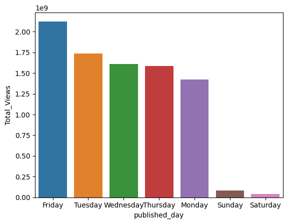
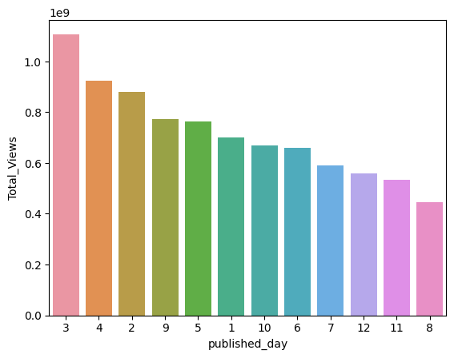
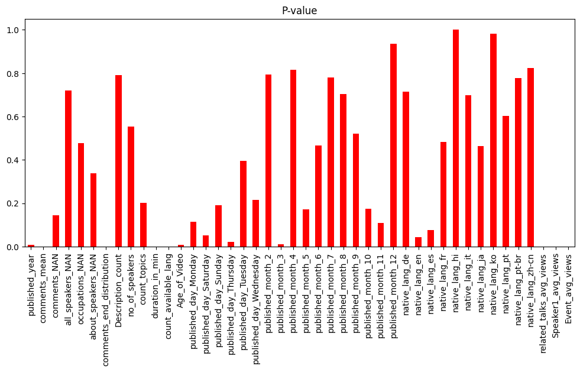
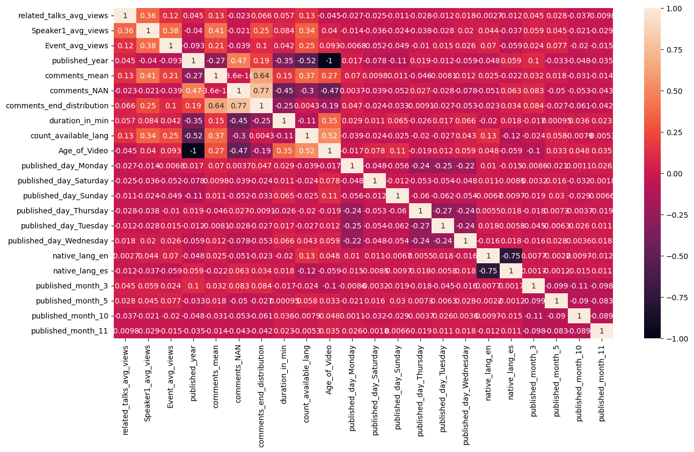
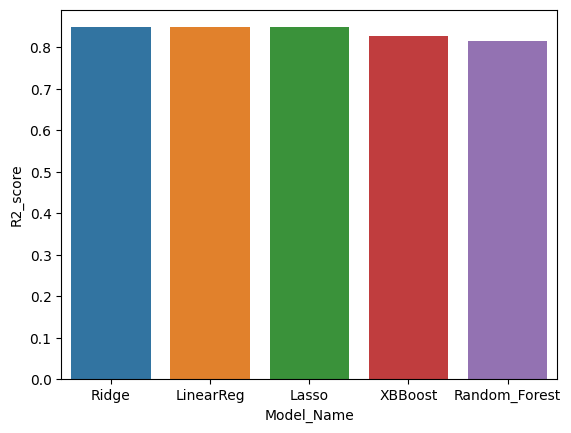

# Ted Talk Views Prediction

### 1. **Objective**: To build predictive model, which help in predicting views of video uploaded on TEDX website.

### 1.1 Data overview:
Number of TED talks: 4,005 
Number of speakers: 3,274 
Number of events: 459 
Timespan: Jun 2006 - Apr 2020 
Attributes: 19 

### 1.2 Type of Machine learning problem
Task is to predict views of TED talk videos => Regression problem

### 1.3 Performance Metric
1. MAE,MSE,RMSE
2. R2_Score

### 2. Exploratory Data Analysis 
#### 2.1 Distribution of TEDX videos by weekdays with sum of target variable (views) 

#### 2.1 Distribution of TEDX videos by weekdays with sum of target variable (views) 

### 3. Feature Engineering
-  Multiple Speakers in Ted Talk we have converted this feature with speakers_avg_views, Mutiple events converted to event_avg_views etc etc
-  Year feature has been converted to Age of video with (2023-(Year when video was published)) to understand how much older the video is.
-  Used One hot encoding on Orignal langauge in which Ted Talk was released to compare Videos langauge wise.

### 4. Feature Selection

#### 4.1 f_regression to get feature importance, Dropping features with higher P-value

#### 4.2 Correlation 

### 5. Comparison of R2_Scores on diffrent Machine learning Models used.
#### 1. Linear Regression
#### 2. Ridge Regressor 
#### 3. Lasso Regressor 
#### 4.  Random Forest Regressor  
#### 5. XGB Regressor 

After comparing all the models w.r.t.o their R2 scores even simple models like linear & Ridge can perform better than ensemble models like Random Forest and XGB with this type of use cases.

